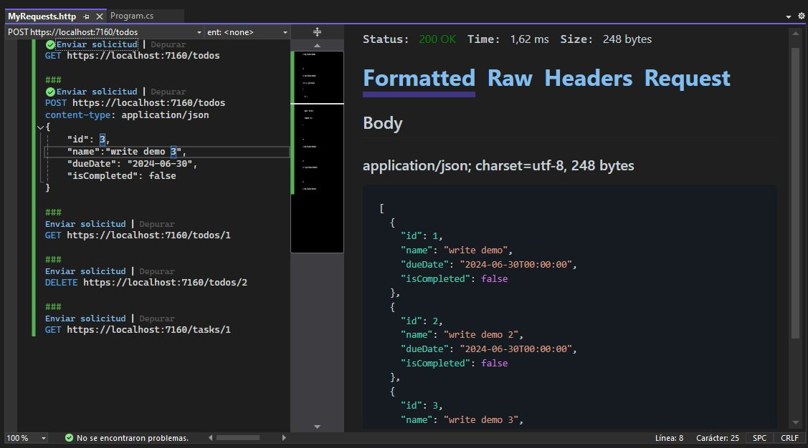
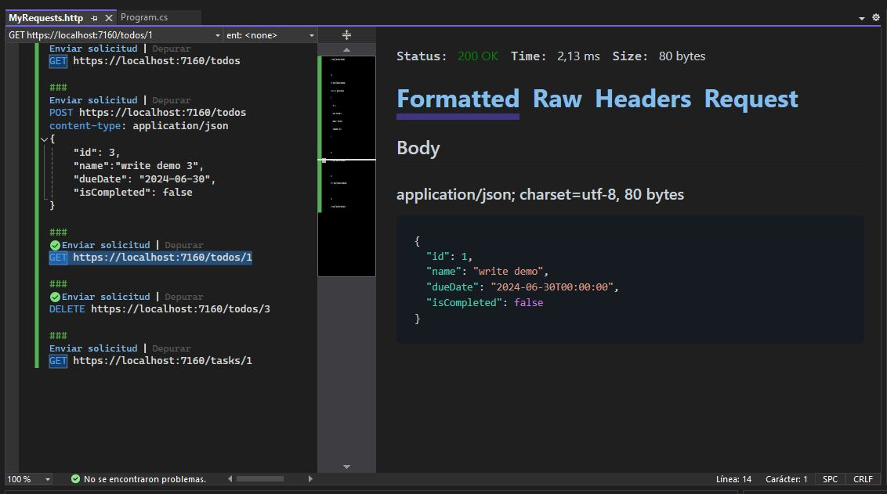
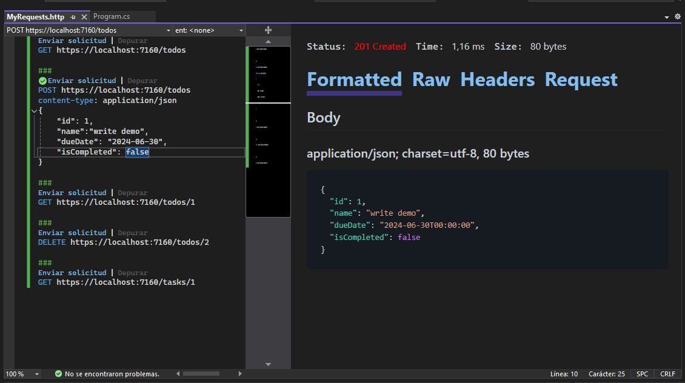
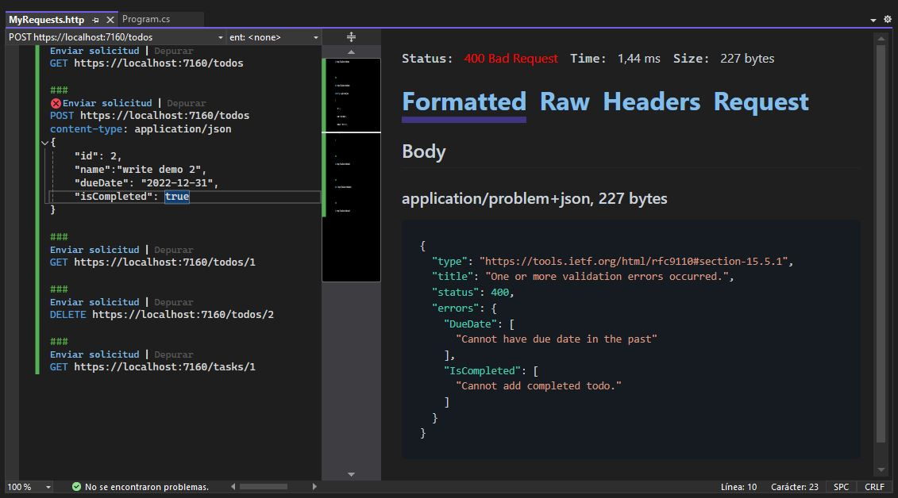
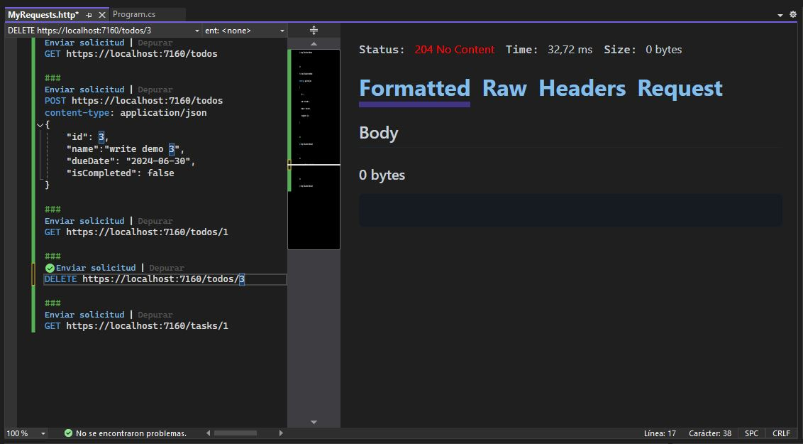

Este es un proyecto de **Web API**, creado gracias a [`ASP.NET Core`](https://dotnet.microsoft.com/es-es/learn/back-end-web-dev)

# 📄 Breve descripción
Este proyecto API WEB de ASP.NET Core se encuentra basado en el contenido de los videos de la documentación de ASP.NET Core del canal de Youtube [`@dotnet`](https://www.youtube.com/watch?v=sHDox4Fx6G0&list=PLdo4fOcmZ0oWunQnm3WnZxJrseIw2zSAk)

## Capturas de pantalla

🔵 Get

🔵 Get Id

🔵 Post

🔵 Validation

🔵 Delete

